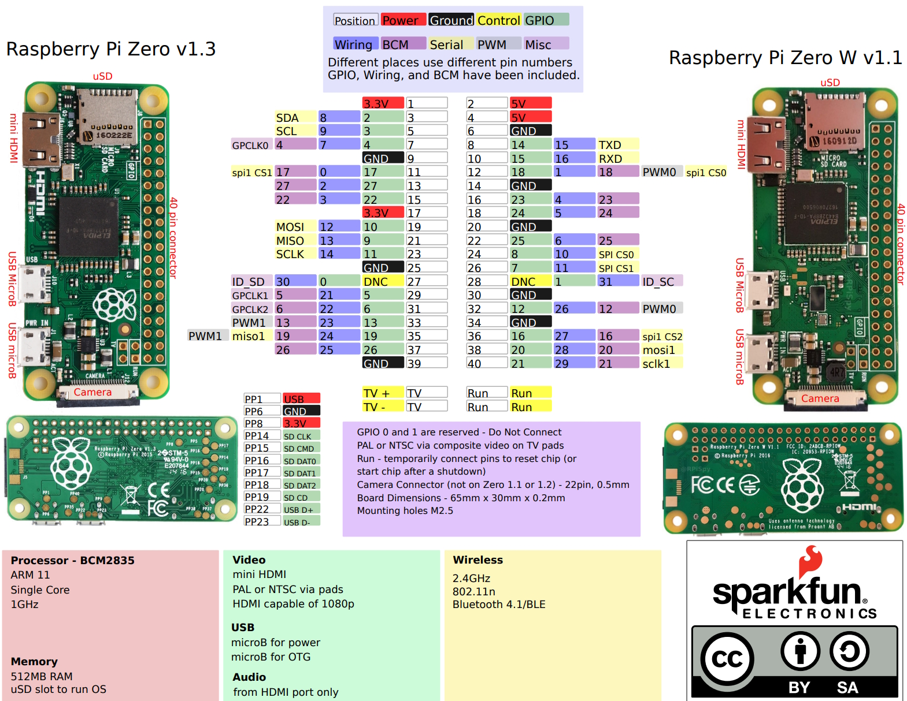

# Double Pulse Generator
## General
Method for Measuring Switching Parameters. The standard test method for measuring switching parameters of Si, SiC, and GaN MOSFETs and IGBTs is the double pulse Test (DPT). Double pulse testing can be used to measure energy loss during device turn-on and turn-off, as well as reverse recovery parameters. A good explanation can be found here: https://www.tek.com/en/documents/application-note/double-pulse-test-tektronix-afg31000-arbitrary-function-generator?anv=2
Program has been set up to be able to run on any Raspberry Pi as bare metal program (but only tested on a Pi Zero, Zero2W 1.1 and Pi4).
Sending a Json like: {"pulseInterval": 500, "pulseWidth1": 10, "interPulseDelay": 200, "pulseWidth2": 10} via the serial port (115200 baud, n, 8, 1) generates:  
>_______________&nbsp; &nbsp; &nbsp; &nbsp; &nbsp; &nbsp; &nbsp; &nbsp; &nbsp; &nbsp; &nbsp; &nbsp; &nbsp; &nbsp; ______________  
>| pulseWidth1 | interPulseDelay | pulseWith2 | pulseInterval  
>&nbsp; &nbsp; &nbsp; &nbsp; 10&nbsp; &nbsp; &nbsp; &nbsp; &nbsp; &nbsp; ______ 200 ______ &nbsp; &nbsp; &nbsp; &nbsp; 10 &nbsp; &nbsp; &nbsp; &nbsp; _____ 500 _____  
## Connections
Connect TXD to GPIO 14, 4th pin from the top, most right row. RXD to GPIO 15, 5th pin from the top, most right row. GND to pin 6, 3rd pin from the top, most right row. Output pulses to GPIO 18, , 6th pin from the top, most right row.  
 for the serial communication.
GPIO21, bottom pin right row, is giving pulses of 1/10th of a second. Can be used as a hart beat indicator. If wired via an LED (with 470Ohm resistor) to GND (bottom pin left row). 
## Thanks to
Software is partly used from Teensy 4.0 Signal Generator, Electronics Workshop, Robin O'Reilly.
For JSON extraction thanks to https://github.com/zserge/jsmn/. 
For starting with the bare metal programming https://github.com/dwelch67/raspberrypi-zero.

## Generating code
The Compiler to be used can be downloaded from https://developer.arm.com/downloads/-/arm-gnu-toolchain-downloads
I had to include the install directories in my system variables PATH by hand. Do not know why, and did not spent the time to find out why.

To generate the build files via Cmake follow the following commands.
Run the following command from the directory where the files reside. To configure for a specific system, type and version:
`cmake -B <NAME> -G "Unix Makefiles" -DARCH=<VERSION> -DRPI_MODEL=<MODEL> -DCMAKE_BUILD_TYPE=<TYPE> -DDUALCORE=<BOOL>`
Whereby:
\<NAME\> can be anything you want. F.e. “build_Z1_32bit”. This wil be used as the output directory where all of your build files will be located. The actual output (kernel.img, kernel7.img or kernel8.img) can be found in the \<NAME\>/bin.
\<VERSION\> must be 'arm32' or 'arm64' depending if you want to use 32bit or 64bit version of the program.
\<MODEL\> must be one of the boards listed below in 'List of possible boards' depending on the version raspberry pi you are using.
\<TYPE\> Options are 'Release' or 'Debug'. If using 'Debug' the config.txt file generated will enable for JTAG debugging. Additional debug files are generated as well in the \<NAME\>/bin directory.
\<BOOL\> Can be 'on' or 'off'. Use 'on' if you want to use the second core. The second core will then be used for the pulse generation. Core0 for the serial communication. If 'off' everything is being handled by Core0. 
For example if you want to build for a raspberry pi Zero1, use:
`cmake -B build_Z1 -G "Unix Makefiles" -DARCH=arm32 -DRPI_MODEL=RPIZ1 -DCMAKE_BUILD_TYPE=Release -DUALCORE=off`
This will configure the build system, and generates the MAKE files in the <NAME> directory.
Now we can compile, do:
`cmake --build <NAME>`.
As an alternative you could also enter the \<NAME\> directory via `cd <NAME>` and run `make`.

If you want to see what is going on under the hood add `--verbose` to the command.
When the source file(s) have changed you need to run `cmake --build <NAME> again.
If a configuration has changed (f.e. New version compiler has been installed), you need to rerun the `cmake -B ….' command. But then first do 'rm -r <NAME>/*`
If you want debugging information add `-DCMAKE_BUILD_TYPE=Debug` to the `cmake -B …` command.

Now copy all files in the /sdcard directory to your SD_Card and insert in your Raspberry

## Modifying values via JSON
Included is a .exe file to run on a windows pc to generate a JSON (only to use with this DoublePulse_Tester). Source code can be found on https://github.com/ErikBakker100/JSONGenerator
Of course any terminal program can be used as well. 'Realterm', 'Putty', 'Termite' and so on.

## Updating Arm toolchain
Make sure your toolchain directory is in your 'PATH' systemvariable.

## List of possible boards
Choose onde of the following boards. Use the left side table. f.e. -DBOARD=RPIZ2W.  
- RPIA            Raspberry Pi 1A  
- RPIB            Raspberry Pi 1B  
- RPIA_PLUS       Raspberry Pi 1A+  
- RPIB_PLUS       Raspberry Pi 1B+  
- RPI2B           Raspberry Pi 2B  
- RPIALPHA        Raspberry Pi Alpha  
- RPICM1          Raspberry Pi Compute Module 1  
- RPI3B_V11       Raspberry Pi 3B  
- RPIZ1           Raspberry Pi Zero 1  
- RPICM3          Raspberry Pi Compute Module 3  
- RPIZ1W          Raspberry Pi Zero 1W  
- RPI3B           Raspberry Pi 3B  
- RPI3A_PLUS      Raspberry Pi 3A+  
- RPICM3_PLUS     Raspberry Pi Compute Module 3+  
- RPI4B           Raspberry Pi 4B  
- RPI3B_PLUS      Raspberry Pi 3B+  
- RPI400          Raspberry Pi 400  
- RPICM4          Raspberry Pi Compute Module 4  
- RPIZ2W          Raspberry Pi Zero 2(W)  
- RPI5            Raspberry Pi 5  
- RPICM5          Raspberry Pi Compute Module 5  
- RPI500          Raspberry Pi 500  
- RPICM5_LITE     Raspberry Pi Compute Module 5 Lite  
